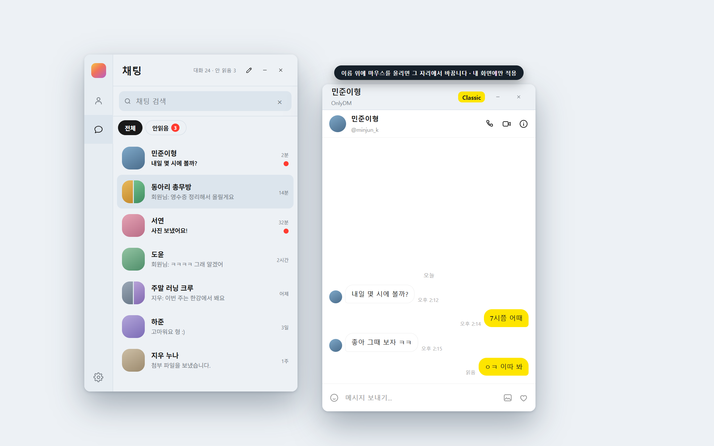

# OnlyDM

**인스타 DM만 띄워두는 윈도우 메신저.**

회사에서 카카오톡 창은 그냥 띄워둡니다. 그런데 인스타그램은 그러기가 좀 그렇더라고요. 피드에 릴스에 스토리까지 한 화면에 다 나오니까요. 그렇다고 답장하겠다고 폰을 계속 손에 들고 있을 수도 없고요.

그래서 깎고 깎아서 **DM만 남겼습니다.** 피드도, 릴스도, 탐색 탭도 안 뜹니다. 대화 목록과 채팅창만 있는 평범한 메신저 창처럼 보입니다.

저랑 같은 고민 하셨던 분들은 편하게 가져다 쓰세요.



<sub>실제 대화 대신 예시 데이터로 찍은 화면입니다.</sub>

## 어떻게 동작하나요

로그인과 메시지는 전부 **인스타그램 웹**에서 일어납니다. 브라우저로 접속하는 것과 똑같은 페이지를, 윈도우에 내장된 Edge WebView2가 대신 띄워줄 뿐입니다.

OnlyDM은 그 위에 자기 화면을 그립니다. 인스타그램이 이미 그려놓은 대화 목록을 읽어서 메신저 UI로 다시 보여주는 방식이라, 비공식 API를 뚫거나 서버를 따로 두지 않습니다. 별도 서버가 아예 없습니다.

## 쓰는 느낌

써오던 메신저와 최대한 비슷하게 맞췄습니다.

**대화**
- 최신 대화가 위로 올라오고, 안 읽은 방에는 빨간 배지가 붙습니다
- 이름·아이디·직접 지은 이름 중 아무거나로 검색됩니다
- 더블클릭이나 <kbd>Enter</kbd>로 채팅방 열기, <kbd>↑</kbd> <kbd>↓</kbd>로 이동, <kbd>Esc</kbd>로 닫기
- 창을 닫아도 쓰던 메시지는 남아 있습니다. 다시 열면 그대로예요
- 한 번 열어본 방은 주소를 기억해서 다음부터 훨씬 빨리 열립니다

**사람**
- 친구 목록은 팔로잉에서 가져옵니다. 한 번 불러오면 저장해두고, 필요할 때 새로고침만 누르면 됩니다
- 프로필을 누르면 1:1 채팅 · 음성 통화 · 영상 통화
- 새 채팅은 사람을 고르기만 하면 됩니다. 한 명이면 개인방, 여러 명이면 단체방, 이미 있는 방이면 그 방으로 갑니다

**이름 바꾸기**
- 채팅창 제목이나 프로필 카드에서 **이름 위에 마우스를 올리고 그냥 고치면** 됩니다
- 아이디에 붙는 이름이라, 채팅방에서 바꾸면 친구 목록도 같이 바뀝니다. 반대도 마찬가지고요
- 단체방은 방 이름을 따로 붙일 수 있습니다
- **이건 제 컴퓨터에서만 바뀝니다.** 인스타그램에도, 상대방 화면에도 전혀 반영되지 않아요. 마음 편하게 바꾸세요
- 비워두면 원래 이름으로 돌아갑니다

**그 외**
- 새 DM이 오면 윈도우 알림이 한 번 뜹니다. 눌러서 바로 그 방으로 들어갈 수 있고, 내용을 가리고 싶으면 설정에서 끄면 됩니다
- 테마 두 가지(Classic / DM), 바꾸면 바로 반영됩니다
- X를 누르면 트레이로 내려갑니다. 트레이 메뉴에서 테마·자동 시작·알림을 바로 켜고 끌 수 있어요
- 페이지가 죽으면 알아서 다시 불러오고, 더 크게 문제가 생기면 스스로 재시작합니다

## 이건 걱정 안 하셔도 됩니다

**자동 로그인은 이 컴퓨터에만 저장됩니다.** WebView2가 브라우저처럼 세션을 들고 있는 것이고, OnlyDM 코드는 비밀번호도 쿠키도 토큰도 따로 건드리지 않습니다. 어디로도 보내지 않고요. 애초에 보낼 서버가 없습니다.

바꾼 이름, 대화방 주소, 친구 목록 캐시는 전부 내 PC에만 저장되고, 윈도우 DPAPI로 이 계정에서만 열리게 잠급니다.

저장 위치는 `%LOCALAPPDATA%\OnlyDM` 한 곳입니다.

| | |
| --- | --- |
| `WebView2\` | 인스타그램 로그인 세션 (WebView2가 관리) |
| `settings.json` | 테마·알림·자동 시작 설정 |
| `threads.json` · `friends.json` · `aliases.json` | 대화방 주소, 친구 목록, 내가 지은 이름 (DPAPI 보호) |

지우고 싶으면 폴더째 지우거나 `odm uninstall`을 실행하면 깨끗하게 사라집니다.

자세한 내용은 [PRIVACY.md](PRIVACY.md)에 적어뒀습니다.

## 설치

Node.js 18 이상이 있다면 이게 제일 간단합니다.

```powershell
npm install -g @thisnorm/onlydm
odm start
```

처음 `odm start`가 앱을 받아서 설치하고, 그다음부터는 바로 실행됩니다. 관리자 권한은 필요 없습니다.

| 명령어 | 설명 |
| --- | --- |
| `odm start` · `odm stop` · `odm restart` | 실행 · 종료 · 재시작 |
| `odm status` | 설치 상태와 버전 확인 |
| `odm on` · `odm off` | 윈도우 시작 시 자동 실행 켜기/끄기 |
| `odm update` | 최신 버전으로 업데이트 |
| `odm uninstall` | 앱과 로컬 데이터 삭제 |

Node.js가 없다면 파워셸로도 됩니다.

```powershell
$releaseTag = 'v0.2.4'
$installer = Join-Path $env:TEMP 'OnlyDM-install.ps1'
Invoke-WebRequest -Uri "https://github.com/thisNorm/OnlyDM/releases/download/$releaseTag/install.ps1" -OutFile $installer
& powershell.exe -NoProfile -ExecutionPolicy Bypass -File $installer -ReleaseTag $releaseTag
Remove-Item -LiteralPath $installer -Force
```

x64인지 ARM64인지 알아서 고르고, 받은 파일을 SHA-256으로 확인한 뒤 `%LOCALAPPDATA%\Programs\OnlyDM`에 설치합니다. 설치나 업데이트 전에는 OnlyDM을 닫아주세요.

**필요한 것**: 윈도우 10/11, 그리고 Edge WebView2 런타임. WebView2가 없으면 설치해도 되는지 먼저 물어본 다음 마이크로소프트 공식 설치 프로그램을 받아서 실행합니다. .NET은 따로 안 깔아도 됩니다(배포본에 포함).

## 잘 안 될 때

**인스타그램이 추가 인증을 요구할 때** — 보안 확인 페이지는 `/accounts/login` 바깥 주소로 열려서 OnlyDM이 막습니다. 브라우저에서 인증을 마친 다음 다시 실행해 주세요.

**처음 켰을 때 목록이 비어 있을 때** — 인스타그램은 대화 목록을 조금씩만 그려주기 때문에, 전체를 모으려고 한 번 훑습니다. 대화가 많으면 잠깐 걸립니다.

## 직접 빌드하기

```powershell
# 소스에서 실행
dotnet run --project .\src\OnlyDM\OnlyDM.csproj

# 정책 테스트 + Release 빌드 + 배포 검사 + UI 계약 검사
powershell -ExecutionPolicy Bypass -File .\scripts\verify.ps1

# 배포용 zip + SHA-256 만들기 (artifacts 폴더)
powershell -ExecutionPolicy Bypass -File .\scripts\package.ps1
powershell -ExecutionPolicy Bypass -File .\scripts\package.ps1 -RuntimeIdentifier win-arm64
```

`v*` 태그를 푸시하면 [릴리스 워크플로](.github/workflows/release.yml)가 검증하고, x64/ARM64 자체 포함 빌드를 만들어 체크섬과 함께 GitHub Release로 올립니다.

<details>
<summary>손으로 확인해보는 항목들</summary>

1. 실행하면 대화 목록만 보이고 인스타그램 화면은 안 나오는지
2. 로그인 후 껐다 켜면 세션이 유지되는지
3. 검색이 걸리고 지우면 원래대로 돌아오는지
4. 채팅창 두 개를 열고, 쓰던 메시지가 닫았다 열어도 남아 있는지
5. 채팅창에서 이름을 바꾸면 친구 목록과 대화 목록도 따라오는지
6. DM이 왔을 때 알림이 한 번만 오고, 눌러서 그 방으로 가는지
7. 테마를 바꾸고 재실행해도 유지되는지
8. X로 트레이에 내려갔다가 트레이 메뉴로 다시 열리는지
9. `odm status` · `odm on` · `odm off` · `odm restart`가 상태를 맞게 알려주는지
10. 재설치가 되고, 삭제하면 `%LOCALAPPDATA%\OnlyDM`이 없어지는지

</details>

## 라이선스

MIT입니다. [LICENSE](LICENSE)를 보세요. 마음대로 가져다 쓰고 고치셔도 됩니다.

OnlyDM은 개인이 만든 비공식 프로그램입니다. Instagram, Meta와는 아무 관계가 없고 후원이나 승인을 받은 적도 없습니다. Instagram과 Meta는 각 회사의 상표입니다.
